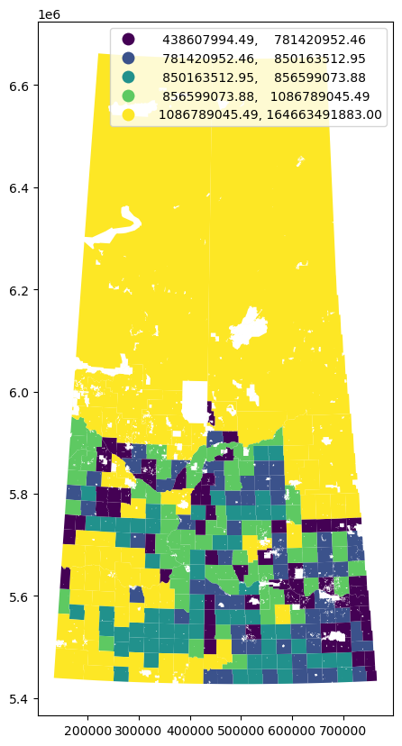

# Palette Training - GIS & Data Science
 A notebook of the training for data science from Palette Skills the instructor for this program is https://github.com/ruhidm

 ## 📖 Background

I am attending the Automation and Digital Agriculture Specialist Program from Palette Skills, which consist of 130 hours of training. The goal of the program is to prepare me with the necessary skills and knowledge to implement technological solutions in the agricultural industry in Saskatchewan. The training is led by industry experts and includes hands-on, project-based learning in emerging technologies such as GIS, IoT, drones, AI, robotics, and big data. Through the program, I also developed professional skills in project management, business development, problem-solving, and team-building.

## 💾 The data

In the following experiences we explored dataset related to the agriculture industry which include dataset of RM information and crop yields. We applied different machine learning models on the data and extracted key findings to present to keystake holders of a industry. 

